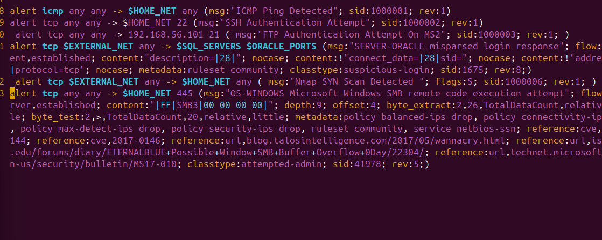

# Snort IDS - Home Lab
A comprehensive Network based IDS (NIDS) home lab that utilizes snort by detecting &amp; analyzing real world attacks, including custom rules &amp; configured to monitor TCP/IP, SMB, and HTTP protocols in a virtualized environment.

## Overview: 
This project was built in a virtualized environment as the role of the home lab to monitor TCP/IP, SMB, and HTTP protocols. Whereas it is a hands-on demonstration of a Network Intrusion detection system (NIDS).
This lab, using Snort, simulates a real world defense environment in which custom rules are designed to protect a vulnerable target. Ranging from stealthy reconnaissance to high impact exploits like EternalBlue.

## Skills & Tools: 
**Core skills**: Intrusion detection Systems (IDS), Packet sniffing & Analysis, Network Security Monitoring (NSM).

**Tools**: Snort, Nmap, Wireshark.

**Environment**: Kali Linux (Attacker), Ubuntu (IDS Sensor - Running snort), Metasploitable 2 (Target).

## Snort/System Architecture:
To understand how the IDS operates, I deployed Snort as a dedicated sensor to monitor virtual network traffic with the objective of following a standard Network Security Monitoring (NSM) model. This pipeline captures traffic, decodes protocols and passes them through custom rule sets that identify malicious patterns and alert them in real time.

## Phase 1: Configuration &  Initialization
I developed a customized configuration file, 'snort-lab.conf', to define the specific network variables ($HOME_NET vs $EXTERNAL_NET) and port groups for this environment. 

**Initialization**: Successfully loaded *4,062 total rules* with *3,388 specialized detection rules* active for real-time monitoring.

**Engine Stability:** Confirmed the parser successfully defined $HTTP_PORTS, $SSH_PORTS, and $FTP_PORTS.

## Phase 2: Custom Rule Development
I created specific rules in 'local.rules' to detect common attacks. Thus demonstrating the ability to write custom logic for multiple protocols.

* **MS17-010 (EternalBlue):** Implemented an advanced signature to identify buffer overflow attempts in SMB traffic.
* **Signature Logic:** Created rules to flag ICMP pings, SQL Injection strings (' OR '1'='1'), and unauthorized FTP/SSH access attempts.

## Phase 3: Live Detection & Analysis
I simulated a series of attacks from a Kali Linux VM (Virtual machine) to a vulnerable Metasploiable 2 VM (Virtual Machine) to verify the IDS response through packet sniffing and analysis.

### 1. Nmap Scan (SYN) Detection
Using an 'Nmap -sS' (TCP Stealth) scan, the IDS triggered immediate alerts, identifying the source IP and the specific target ports.

### 2. Packet Analysis (Wireshark)
To verify the alert, I performed a packet analysis. The Wireshark capture confirms the SYN Flag without the following ACK. In a standard connection, a SYN is followed by a SYN-ACK. However, the packet captures show the attacker moving to the next port immediately after the SYN. 

## Phase 4: Final Validation & Action Stats
The final stats confirm a 100% detection rate for the simulated threats. This summary provides a view of the system's performance and confirms that all threats (Ping, FTP, SQLi) were successfully logged.

**Metrics:**
* **Alerts & Logged:** Confirms the total number of malicious events captured during the simulation.
* **Protocol Distribution:** Validates that Snort was monitoring across TCP, UDP, ICMP, and IP layers.
This shows the rule engine successfully processed thousands of rules without system faults.

**Takeaways & Conclusions**:
I successfully transitioned from using default rules to authoring custom logic for detecting complex exploits like EternalBlue, ensuring detection with minimal false positives and I gained hands on experience in Network Security Monitoring (NSM) by correlating IDS alerts with low-level packet data to map out and analyze the full lifecycle of an attack.
