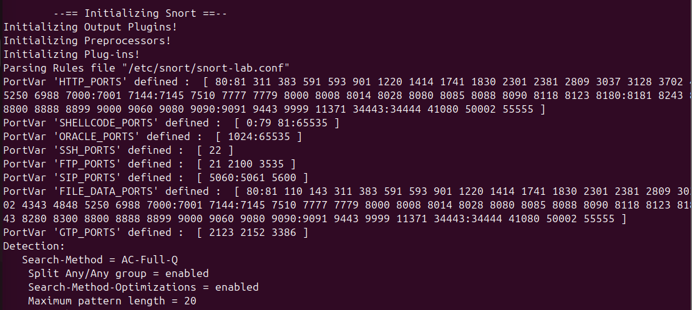

# Snort IDS- Home-Lab
A comprehensive Network based IDS (NIDS) home lab that utilizes snort by detecting &amp; analyzing real world attacks, including custom rules &amp; configured to monitor TCP/IP, SMB, and HTTP protocols in a virtualized environment.

## Overview: 
This project was built in a virtualized environment as the role of the home lab to monitor TCP/IP, SMB, and HTTP protocols. Whereas it is a hands-on demonstration of a Network Intrusion detection system (NIDS).
This lab, using Snort, simulates a real world defense environment in which custom rules are designed to protect a vulnerable target. Ranging from stealthy reconnaissance to high impact exploits like EternalBlue.

## Skills & Tools: 
**Core skills**: Intrusion detection Systems (IDS), Packet sniffing & Analysis, Network Security Monitoring (NSM).

**Tools**: Snort, Nmap, Wireshark.

**Environment**: Kali Linux (Attacker), Ubuntu (IDS Sensor - Running snort), Metasploitable 2 (Target).

## Snort/System Architecture:
To understand how the IDS operates, I deployed Snort as a dedicated sensor to monitor virtual network traffic with the objective of following a standard Network Security Monitoring (NSM) model. This pipeline captures traffic, decodes protocols and passes them through custom rule sets that identify malicious patterns and alert them in real time.

## Phase 1: Configuration &  Initialization
I developed a customized configuration file, snort-lab.conf, to define the specific network variables ($HOME_NET vs $EXTERNAL_NET) and port groups for this environment. 

**Initialization**: Successfully loaded *4,062 total rules* with *3,388 specialized detection rules* active for real-time monitoring.

**Engine Stability:** Confirmed the parser successfully defined $HTTP_PORTS, $SSH_PORTS, and $FTP_PORTS.

